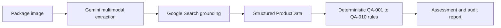

# SIH26034 — LexScan Quality Assurance

LexScan is a local React + FastAPI prototype for packaged-label inspection. It extracts only visible label evidence, runs deterministic QA checks, and optionally compares the visible product identity with grounded public references.

## Safety and decision boundary

- Gemini extracts and interprets image evidence; deterministic Python rules decide PASS, FAIL, REVIEW, or NA.
- Missing MRP or manufacture/packing date stays missing and is flagged by the rules. A public web price or guessed date is never substituted.
- An address is cross-checked on the web only as a company/address consistency check. It is not converted into an inferred country of origin.
- A front-only image can be compared with official product images, but hidden back-panel declarations, batch data, dates, and MRP are not claimed to be checked. The result asks for more images.
- QA-010 uses `MATCH`, `MISMATCH`, or `UNVERIFIED`. `MATCH` means consistency with a public reference, not proof that a physical item is genuine.
- Live extraction errors fail closed. The backend never replaces a failed live request with a compliant demo product.

## Pipeline



## QA rules

| Rule | Check |
| --- | --- |
| QA-001 | Manufacturer / packer / importer name and address |
| QA-002 | Explicit country-of-origin and import evidence |
| QA-003 | Generic commodity name |
| QA-004 | Net quantity and SI unit |
| QA-005 | Manufacture or packing date |
| QA-006 | Best-before, use-by, or expiry declaration |
| QA-007 | Maximum retail price (MRP) |
| QA-008 | MRP tax-inclusive wording |
| QA-009 | Consumer-care / grievance contact |
| QA-010 | Grounded public-reference identity and package comparison |

## Folder layout

```text
SIH26034-Smart-Legal-Metrology-main/
├── backend/
│   ├── app/
│   │   ├── api/                 # FastAPI routes
│   │   ├── rules/               # Pure deterministic QA rules
│   │   ├── services/            # Gemini, orchestration, local storage
│   │   └── utils/               # Image validation
│   ├── tests/                   # Rule and AI repeatability tests
│   ├── requirements.txt
│   └── .env.example
├── frontend/
│   ├── src/
│   │   ├── components/
│   │   ├── pages/
│   │   ├── services/api.js
│   │   └── App.jsx
│   └── package.json
└── README.md
```

## Windows setup

Run these commands from this project folder:

```powershell
python -m venv .venv
.\.venv\Scripts\Activate.ps1
python -m pip install -r backend\requirements.txt
python -m pip install pytest
Copy-Item backend\.env.example backend\.env
```

Open `backend/.env` and set a valid Google AI Studio key:

```text
GEMINI_API_KEY=your_key_here
GEMINI_MODEL=gemini-3.1-flash-lite
CORS_ORIGINS=http://localhost:5173,http://127.0.0.1:5173
```

Keep `backend/.env` local; it is ignored by Git. Never commit the key.

## Run

Terminal 1 — backend:

```powershell
cd backend
..\.venv\Scripts\python.exe -m uvicorn app.main:app --host 127.0.0.1 --port 8000
```

Terminal 2 — frontend:

```powershell
cd frontend
npm install
npm run dev
```

Open [http://127.0.0.1:5173/](http://127.0.0.1:5173/). API documentation is at [http://127.0.0.1:8000/docs](http://127.0.0.1:8000/docs).

## Diagnostics

```powershell
..\.venv\Scripts\python.exe -m pytest backend\tests -q
..\.venv\Scripts\python.exe backend\test_gemini.py
```

The Results screen has a **Check model consistency** action for the current upload. It performs two independent extractions and reports the agreement score plus differing fields. A live request with an invalid key returns HTTP 503 and does not save a false inspection.

The status endpoint reports the configured model and grounding capability:

```text
GET /api/inspection/status/config
POST /api/inspection/consistency-check
```

## Demo mode

The dashboard demo cards use deterministic sample data and explicitly mark QA-010 as `NOT_APPLICABLE`. Use them to inspect the UI and rule engine without consuming API quota. Demo mode is not used for live uploads.

## Deployment

The root `vercel.json` is configured for Vercel Services, so the frontend and FastAPI backend can deploy together under one domain:

1. Import this repository into Vercel and choose the **Services** preset. Click **Refresh** if Vercel says `vercel.json` is required. You should see `frontend` at `/` and `backend` at `/api`.
2. Add `GEMINI_API_KEY` as a Vercel environment variable for the backend. Keep it out of frontend variables.
3. Deploy. The frontend keeps using `/api`, and Vercel routes those requests to FastAPI.

If Vercel Services is unavailable, use the included `render.yaml` for the backend and set `VITE_API_BASE_URL` in Vercel to `https://<backend-host>/api`.

## Disclaimer

This is a prototype screening tool. A final regulatory determination and authenticity decision must be made by an authorized inspector using the applicable current rules and complete physical-package evidence.
